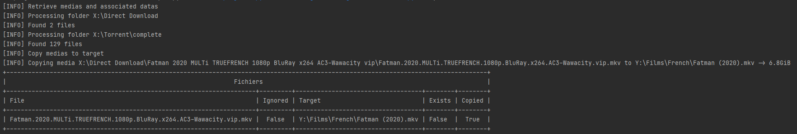
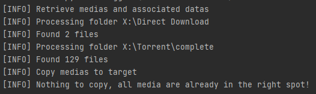

darkanakin41/media-organizer
===

This is a simple way for me to organize my downloaded medias from download folder to the right path.

Based on the configuration, it scan for media files in a folder, retrieve details from [themoviedb](https://www.themoviedb.org/)
and then copy them to the appropriate target folder.

If the target file already exist, it is not overwrote.

# Usage

```shell
$ media-organizer --help
Usage: media-organizer [OPTIONS]

Options:
  --verbose  Verbose mode
  --silent   Silent mode
  --dry-run  Dry Run
  --ignored  Displayed ignored files in results.
  --exists   Displayed target already existing in results.
  --help     Show this message and exit.
```

# Example results :

## When files are copied



##When nothing have to be done



# TODO

* [ ] Add Unit Testing
* [ ] Add release pipeline
* [ ] Add Lint

